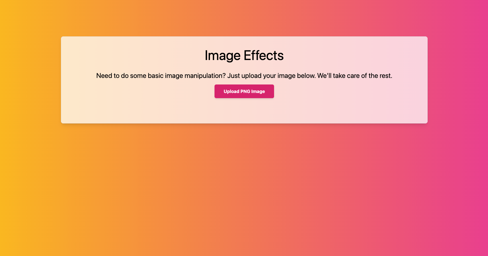
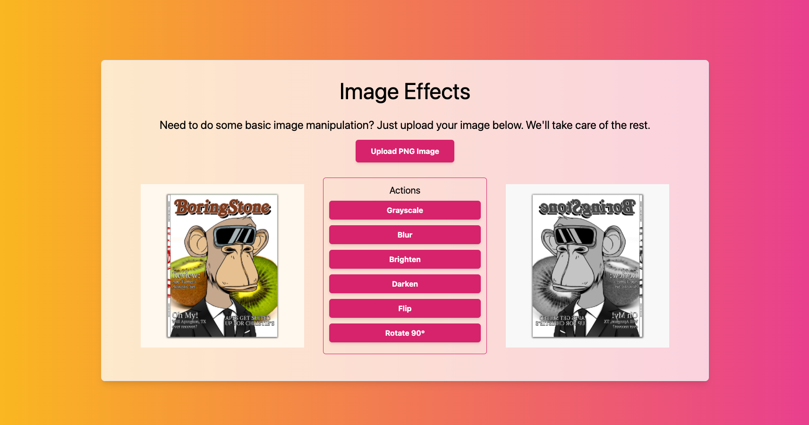

# Setting up Web Assembly in a NextJS App (name undecided)

### Table of Contents
  * [Demo Application](#demo-application)
  * [Quick Rundown of Web Assembly](#quick-rundown-of-web-assembly)
  * [Adding Wasm to Next.js app](#adding-wasm-to-nextjs-app)
  * [Issues I ran into](#issues-I-ran-into)
  * [Contact](#contact)

## Demo Application

In this post we're going to learn how to get web assembly running in our Next.js applications. In order to do that, we'll be looking at this [demo](https://wasm-image-processor.vercel.app/) site I built.

 |
|-|-|

It is a pretty basic web app that uses web assembly to process images. You can grayscale, blur, rotate, etc., to edit your image. Before going further, I absolutely need to give credit to Andrei Neagoie and Luis Ramirez Jr for the course at https://academy.zerotomastery.io/p/learn-webassembly. This set the groundwork for the application and my knowledge with using wasm. We used Rust to compile to web assembly. I took what I learned here and simply added to it to make it more my own and challenge myself. To do this, I used Next.js, Typescript, and added more image processing functionality in the Rust code.

## Quick Rundown of Web Assembly

### What is Web Assembly/Wasm?

Before going too deep it would probably get a good idea to give a brief overview of what web assembly even is. https://webassembly.org/ describes it in the following way.

> WebAssembly (abbreviated Wasm) is a binary instruction format for a stack-based virtual machine. Wasm is designed as a portable compilation target for programming languages, enabling deployment on the web for client and server applications.

Let's break down what that means in simpler terms. 

> WebAssembly (abbreviated Wasm) is a binary instruction format for a stack-based virtual machine.

A stack is a very old computer science concept. It is a linear data structure that is FILO (first in, last out) order. Web assembly instructions are pushed onto and popped off the stack in order to perform calculations. 

> Wasm is designed as a portable compilation target for programming languages, enabling deployment on the web for client and server applications.

This is the more interesting part to me, and more relavent to the demo application. It being a compilation target means you can write code in a variety of languages and compile it to web assembly. Writing web assembly by hand is technically possible, but is probably impractical for anything other than learning. You can write WAT (WebAssembly Text Format) files which is very similar to wasm files, but is human readable. An excellent choice for writing code that compiles to wasm is Rust, which is what was used in the image processing application.

### Why would you want to use Wasm in your apps?  

There are a lot of reasons why you might want to try using wasm in your apps.  

- It is very fast and brings better performance to the web.
- You can now program for the web in many different languages other than HTML, CSS and JavaScript.
- Binary format is portable.
- It is built with security in mind. Web Assembly modules are executed in a sandboxed environment separated from the host runtime.
- With these things in mind, an exhaustive list of use cases can be found [here](https://webassembly.org/docs/use-cases/).

## Adding Wasm to Next.js App

- Run create next app (optionally add typescript)
- Run `cargo init . --lib` inside project directory
- Talk about setting up wasm-pack inside `next.config.js`
- Setup wasm script in `package.json` to compile rust lib to wasm
- Setup Husky to run wasm script before commiting so you have production compilation when pushing to github.

## Issues I ran into

- Deployment to Vercel
- Not sure if `pkg` folder should be checked into source control or not
- Specifically wanted wasm running on the frontend. Did not want any network calls.
  - Mention that could have created npm package for wasm code

## Contact

- [LinkedIn](https://www.linkedin.com/in/ryan-mercadante-11a035152/)
- [Github](https://www.github.com/ryanmercadante)
- [Twitter](https://twitter.com/polkamerc)
- [Email](mailto:ryan.a.mercadante@gmail.com)